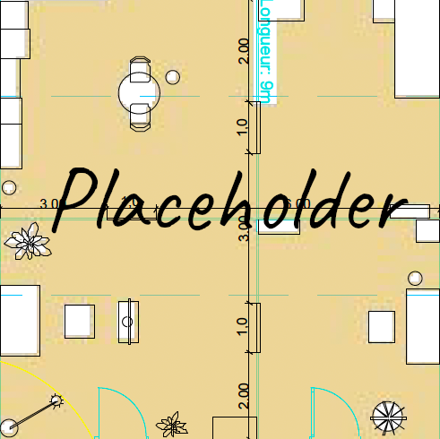

# RoboCup PortugalOpen 2026, Barcelos

## Table of Contents

- [Event](#event)
- [Teams](#teams)
- [Scores](#scores)
- [Schedule](#schedule)
    + [Mapping Slots](#mapping-slots)
    + [Individual Schedules](#individual-schedules)
- [Arena](#arena)
    + [Location Names](#location-names)
    + [Robot Inspection](#robot-inspection-and-poster-session)
    + [Human Robot Interaction](#human-robot-interaction)
    + [General Purpose Service Robot](#general-purpose-service-robot)
    + [Pick and Place](#pick-and-place)
    + [Doing Laundry](#doing-laundry)
    + [Restaurant](#restaurant)
- [General Information](#general-information)

## Event

Official Website [https://www.festivalnacionalrobotica.pt/2026/](https://www.festivalnacionalrobotica.pt/2026/)

## Teams

|   Team Name   |   Country    |                           Institution                          |
|---------------|--------------|----------------------------------------------------------------|
| Gentlebots    | Spain        | Universidad de León                                            |
| LAR@Home      | Portugal     | University of Minho                                            |
| LisTex United | Portugal/USA | Institute for Systems and Robotics (IST) / University of Texas |
| SocRob@Home   | Portugal     | Institute for Systems and Robotics (IST)                       |

## Scores

| Team            |   DL | GPSR |  HRI |   PP | Rest | Total Score |
|-----------------|-----:|-----:|-----:|-----:|-----:|------------:|
| Gentlebots      |    0 |    0 |    0 |    0 |    0 |           0 |
| LAR@Home        |    0 |    0 |    0 |    0 |    0 |           0 |
| LisTex United   |    0 |    0 |    0 |    0 |    0 |           0 |
| SocRob@Home     |    0 |    0 |    0 |    0 |    0 |           0 |

Individual Task scores can be found [here](scores.md)

## Schedule

|       |       Wed 22        |       Thu 23        |       Fri 24        |       Sat 25        |
| ----- | ------------------- | ------------------- | ------------------- | ------------------- |
| 09:00 |                     | Teams Registration  |                     | HRI Challenge (5th) |
| 09:30 |                     |                     |                     | GPSR (5th)          |
| 10:00 |                     |                     |                     | Pick & Place (5th)  |
| 10:30 |                     | HRI Challenge (1st) | HRI Challenge (3rd) | Doing Laundry (5th) |
| 11:00 |                     | HRI Challenge (2nd) | HRI Challenge (4th) |                     |
| 11:30 |                     | GPSR (1st)          | GPSR (3rd)          | League Photo        |
| 12:00 |                     | GPSR (2nd)          | GPSR (4th)          |                     |
| 12:30 |                     |                     |                     |                     |
| 13:00 |                     |                     |                     |                     |
| 13:30 |                     |                     |                     |                     |
| 14:00 | Team Leader Meeting |                     |                     | Finals              |
| 14:30 | Team Leader Meeting |                     |                     | Finals              |
| 15:00 |                     |                     | Restaurant          | Closing Ceremony    |
| 15:30 |                     | Pick & Place (1st)  | Restaurant          | Closing Ceremony    |
| 16:00 |                     | Pick & Place (2nd)  |                     |                     |
| 16:30 |                     | Opening Ceremony    |                     |                     |
| 17:00 |                     | Opening Ceremony    | Pick & Place (3rd)  |                     |
| 17:30 |                     | Doing Laundry (1st) | Pick & Place (4th)  |                     |
| 18:00 |                     | Doing Laundry (2nd) | Doing Laundry (3rd) |                     |
| 18:30 | Robot Inspection    |                     | Doing Laundry (4th) |                     |
| 19:00 | Robot Inspection    | Team Leader Meeting | Team Leader Meeting |                     |
| 19:30 |                     |                     |                     |                     |
| 20:00 |                     |                     |                     |                     |
| 20:30 |                     |                     |                     |                     |
| 21:00 |                     |                     |                     |                     |

### Individual Shedules

#### Wed 22
|   | Robot Inspection |
|---|------------------|
| 1 | Placeholder1     |
| 2 | Placeholder2     |
| 3 | Placeholder3     |
| 4 | Placeholder4     |

#### Thu 23
|   | HRI (1st & 2nd)  | GPSR (1st & 2nd) | PP (1st & 2nd)   | DL (1st & 2nd)   |
|---|------------------|------------------|------------------|------------------|
| 1 | Placeholder1     | Placeholder1     | Placeholder1     | Placeholder1     |
| 2 | Placeholder2     | Placeholder2     | Placeholder2     | Placeholder2     |
| 3 | Placeholder3     | Placeholder3     | Placeholder3     | Placeholder3     |
| 4 | Placeholder4     | Placeholder4     | Placeholder4     | Placeholder4     |

#### Fri 24
|   | HRI (3rd & 4th)  | GPSR (3rd & 4th) | PP (3rd & 4th)   | DL (3rd & 4th)   | Restaurant       |
|---|------------------|------------------|------------------|------------------|------------------|
| 1 | Placeholder1     | Placeholder1     | Placeholder1     | Placeholder1     | Placeholder1     |
| 2 | Placeholder2     | Placeholder2     | Placeholder2     | Placeholder2     | Placeholder2     |
| 3 | Placeholder3     | Placeholder3     | Placeholder3     | Placeholder3     | Placeholder3     |
| 4 | Placeholder4     | Placeholder4     | Placeholder4     | Placeholder4     | Placeholder4     |

#### Sat 25
|   | HRI (5th)        | GPSR (5th)       | PP (5th)         | DL (5th)         | Finals           |
|---|------------------|------------------|------------------|------------------|------------------|
| 1 | Placeholder1     | Placeholder1     | Placeholder1     | Placeholder1     | Placeholder1     |
| 2 | Placeholder2     | Placeholder2     | Placeholder2     | Placeholder2     | Placeholder2     |
| 3 | Placeholder3     | Placeholder3     | Placeholder3     | Placeholder3     | Placeholder3     |
| 4 | Placeholder4     | Placeholder4     | Placeholder4     | Placeholder4     | Placeholder4     |

## Arena

### Location Names

### Robot Inspection

### Human Robot Interaction

### General Purpose Service Robot

### Pick and Place

- "xxx" will be the trash category

### Doing Laundry

### Restaurant

- The objects in the following cathegories may be requested in the customers orders:
    - XXX
    - YYY
    - ZZZ

## General Information

- Arena
  - [Arena map](maps/arena.png)
  - [Task map](maps/arena_task.png)
  - [Location names](maps/location_names.md)
- Objects
  - [Known Objects](objects/objects.md)
  - [Test Objects](objects/test_objects.md)
