# Class drinks (drink)

| Objectname               |  Image                   |
:-------------------------:|:-------------------------:
| juice_pack | 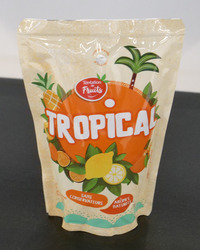 |
| cola | 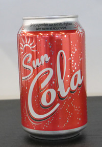 |
| milk | 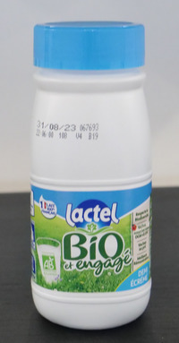 |
| orange_juice | 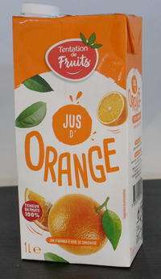 |
| tropical_juice | 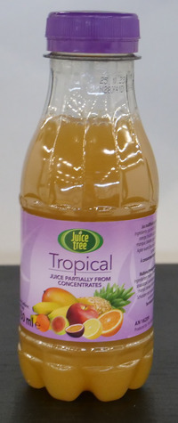 |
| red_wine | 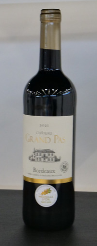 |
| iced_tea | 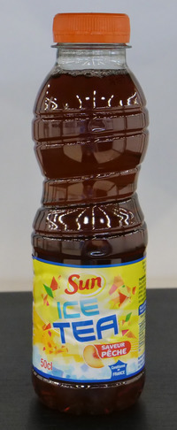 |

# Class toys (toy)

| Objectname               |  Image                   |
:-------------------------:|:-------------------------:
| tennis_ball | 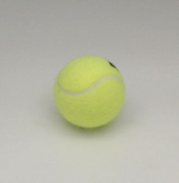 |
| rubiks_cube | 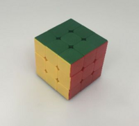 |
| baseball | 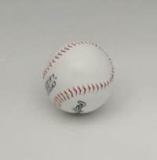 |
| soccer_ball |  |
| dice | 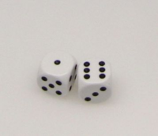 |

# Class fruits (fruit)

| Objectname               |  Image                   |
:-------------------------:|:-------------------------:
| orange | 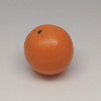 |
| pear | 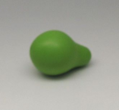 |
| peach | 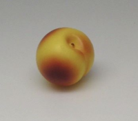 |
| strawberry | 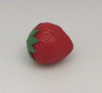 |
| apple | 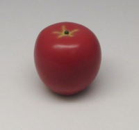 |
| lemon | 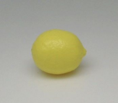 |
| banana | 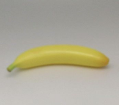 |
| plum | 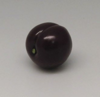 |

# Class snacks (snack)

| Objectname               |  Image                   |
:-------------------------:|:-------------------------:
| cornflakes | 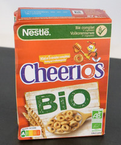 |
| pringles | 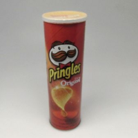 |
| cheezit | 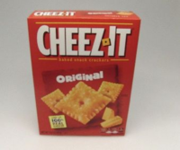 |

# Class dishes (dish)

| Objectname               |  Image                   |
:-------------------------:|:-------------------------:
| cup | 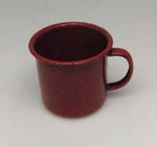 |
| bowl | 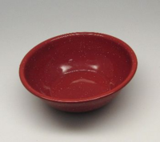 |
| fork | 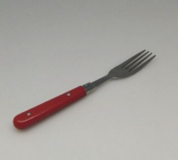 |
| plate | 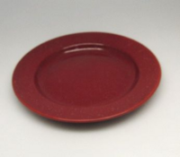 |
| knife | 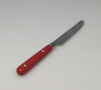 |
| spoon | 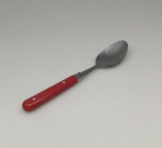 |

# Class food (food)

| Objectname               |  Image                   |
:-------------------------:|:-------------------------:
| chocolate_jello |  |
| coffee_grounds |  |
| mustard |  |
| tomato_soup |  |
| tuna |  |
| strawberry_jello |  |
| spam |  |
| sugar |  |

# Class cleaning_supplies (cleaning_supply)

| Objectname               |  Image                   |
:-------------------------:|:-------------------------:
| cleanser | 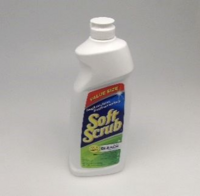 |
| sponge | 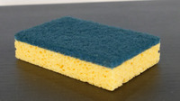 |

